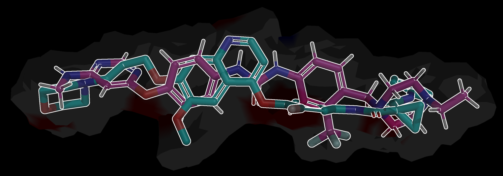

# spalt

[](https://github.com/pagel-s/spalt/actions/workflows/ci.yml)
[](https://codecov.io/gh/pagel-s/spalt)
[](https://opensource.org/licenses/MIT)
[](https://en.cppreference.com/w/cpp/17)
[](https://www.rdkit.org/)
[](http://www.open3d.org/)

**Molecular Surface Generation and Property Computation Library**

A C++ library for generating molecular surfaces from SMILES strings or coordinate files, with electrostatic potential calculations, surface property computation, and colored point cloud alignment.

<p align="center">
  
</p>

## Features

- **Molecular Surface Generation**: MSMS and Fibonacci sphere surface generation
- **Surface Properties**: Electrostatic potential (ESP), hydrophobicity, hydrogen bond potential, and 3D pharmacophore features
- **Advanced Conformer Generation**: K-means clustering and MMFF optimization
- **Multi-Conformer Alignment**: Process multiple conformers with individual surface representations
- **Configurable Charge Methods**: XTB (quantum chemistry) or RDKit (fast) charges for ESP
- **CLI Interface**: Command-line tool with flexible property selection and output options

## Requirements

- **CMake 3.16+**
- **C++17+ compiler** (GCC 9+, Clang 10+, MSVC 2019+)
- **RDKit (C++)**: Required for molecular structure handling
- **Eigen3**: Required for linear algebra operations
- **Open3D**: Required for point cloud alignment
- **OpenMP**: Optional (but highly recommended) for parallel processing
- **MSMS**: Optional for surface generation (auto-detected)
- **XTB**: Optional for quantum chemistry calculations (auto-detected)

## Installation

### Prerequisites

**Important**: RDKit must be installed with C++ development headers. `pip install rdkit` does NOT include these headers.


### System Packages (Ubuntu/Debian)
```bash
# Install system dependencies (includes RDKit C++ headers)
sudo apt update
sudo apt install build-essential cmake ninja-build \
    librdkit-dev rdkit-data libeigen3-dev libopen3d-dev

# Clone and build
git clone https://github.com/pagel-s/spalt.git
cd spalt
cmake -S . -B build \
  -DCMAKE_BUILD_TYPE=Release \
  -DCMAKE_CXX_STANDARD=17 \
  -DSPALT_BUILD_TESTS=ON \
  [-DRDKIT_ROOT=/path/to/rdkit/installation] # if cant be found/ manually installed

cmake --build build -j$(nproc)
cmake --install build  # optional, installs library and executable
```

The CMake build system automatically detects RDKit installations from:
- Conda environments (`$CONDA_PREFIX`)
- Standard system locations (`/usr`, `/usr/local`, `/opt/rdkit`)
- Custom paths via `RDKIT_ROOT`

No manual configuration is needed for most installations!


## Example Usage

### Basic Alignment
```bash
# Basic alignment with default properties (all properties)
./spalt reference.sdf input.sdf output_dir/

# Align SMILES to reference
./spalt reference.sdf "CCO" output_dir/ --properties esp,hb,hy

# Use abbreviated property names
./spalt reference.sdf input.sdf output_dir/ --properties esp,hb,hy
```

### Conformer Generation

When providing 1D/2D input structures (e.g., SMILES strings or 2D SDF files), `spalt` needs to generate 3D conformers before computing surfaces. The process works in three steps: **Sampling**, **Selection**, and **Alignment Filtering**.

```bash
# Generate 100 initial samples, cluster them to pick 10 diverse conformers,
# align all 10 to the reference, and save only the top 5 best-aligned results.
./spalt reference.sdf "CCO" output_dir/ --sample 100 --conformers 10 --top-n 5

# Use a shortcut for robust sampling (--use-advanced is equivalent to --sample 50)
./spalt reference.sdf input.sdf output_dir/ --use-advanced --conformers 5

# Use XTB quantum chemistry charges for high-accuracy ESP (on the generated conformer)
./spalt reference.sdf input.sdf output_dir/ --charge-method xtb --properties esp

# Use Fibonacci surface generation
./spalt reference.sdf input.sdf output_dir/ --mesh fibonacci --properties esp
```

### Output Options
```bash
# Export as point cloud with normals
./spalt reference.sdf input.sdf output_dir/ --output-type points --include-normals

# Save individual surface files
./spalt reference.sdf input.sdf output_dir/ --save-meshes

# Custom surface parameters
./spalt reference.sdf input.sdf output_dir/ --radius 1.5 --properties esp,hb
```

## CLI Options

### **Input/Output**
- `reference_file`: Reference molecule file (.sdf, .mol, .mol2, .pdb)
- `input`: Input molecule (file, SMILES string, or text file with SMILES). Text files can optionally contain a molecule name in the second column separated by a tab or space.
- `output_dir`: Output directory for results

### **Surface Properties**
- `--properties P`: Select properties (`esp`, `hb`, `hy`, `pharma`, `all`, `none`)
- `--charge-method M`: ESP charge method (`xtb`, `rdkit`) (default: rdkit)
- `--mesh {msms|fibonacci}`: Surface generation method (default: fibonacci)
- `--vertices N`: Number of surface vertices (default: 1000)
- `--radius R`: Probe radius for surface generation (default: 1.2)
- `--density D`: Surface density (default: 3.0)
- `--hdensity H`: High density (default: 3.0)
- `--type T`: Surface type: `tses` or `ases` (default: tses)
- `--sample-method S`: Vertex sampling method: `full`, `fps`, `random` (default: full)

### **Conformer Generation**
- `--sample M`: Number of initial candidate conformers to generate and optimize (default: 1). If `M > N`, `spalt` clusters the samples and picks the most diverse geometries.
- `--conformers N`: Final number of diverse 3D conformers to process and align per molecule (default: 1).
- `--top-n K`: After alignment, save only the `K` best-aligned conformers based on surface fitness (default: all).
- `--use-advanced`: Shortcut flag that automatically sets `--sample 50` for deeper conformational searching.
- `--random-seed N`: Random seed for reproducible conformer generation (default: 4).

### **Processing**
- `--threads N`: Number of CPU threads to use for parallel processing (default: auto).
- `--addH`: Add explicit hydrogens to molecules (default: true).
- `--removeH`: Remove explicit hydrogens from input molecules (default: keep/add).

### **Output Options**
- `--output-type {mesh|points}`: Export as triangular mesh or point cloud (default: mesh)
- `--include-normals`: Include vertex normals in output (default: false)
- `--save-meshes`: Save individual surface files for each conformer

## Build and Compile

Make sure you have all the [Requirements](#requirements) installed (e.g., via `apt` and `conda`). 

```bash
# Clone the repository
git clone https://github.com/pagel-s/spalt.git
cd spalt

# Create build directory and configure with CMake
mkdir build && cd build
cmake .. -DCMAKE_BUILD_TYPE=Release

# Compile the project utilizing all available CPU cores
make -j$(nproc)

# The binary will be available at build/spalt
./spalt --help
```

## Testing

```bash
# Build and run all tests
mkdir build && cd build
cmake .. -DCMAKE_BUILD_TYPE=Debug
make -j$(nproc)
ctest --output-on-failure
```


## Contributing

1. Fork the repository
2. Create a feature branch (`git checkout -b feature/new-feature`)
3. Add tests for new functionality
4. Ensure all tests pass (`ctest --output-on-failure`)
5. Submit a pull request

## License

This project is licensed under the MIT License - see the LICENSE file for details.

This does not include dependencies. For all dependencies for which a commercial license
is necessary, and alternative should be implemented.
 

## Acknowledgments

- **RDKit**: For molecular informatics capabilities
- **Open3D**: For 3D data processing and point cloud alignment
- **Eigen**: For linear algebra operations
- **MSMS**: For molecular surface generation
- **XTB**: For quantum chemistry calculations